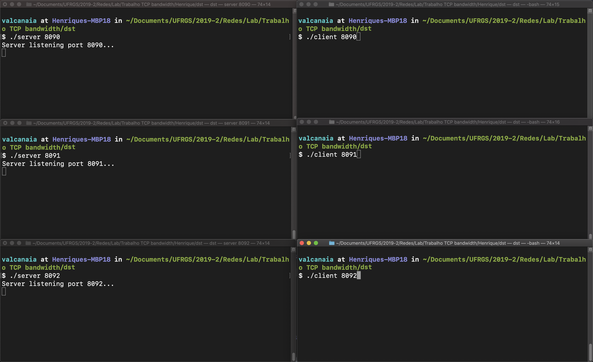
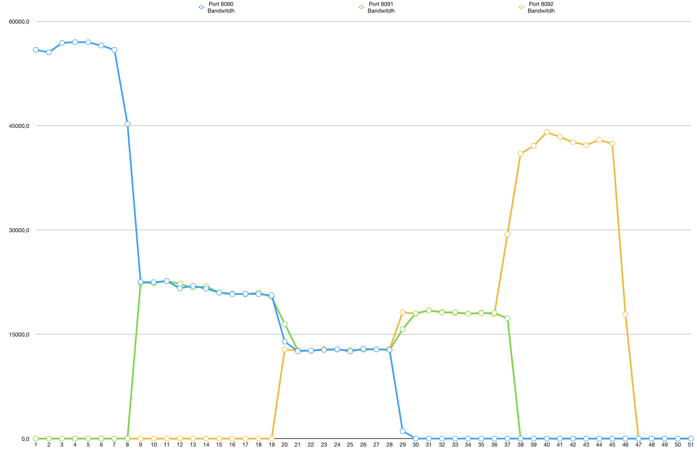

# Atividade Autônoma - (INF01154) Redes de computadores N - 2019/2

## Definição
Criar um programa em TCP que permita analisar equidade do tráfego na rede. O programa deve enviar dados na máxima velocidade possível pela rede (no laboratório é de 1G bit/s). Um parâmetro de entrada deve ser a porta a ser utilizada, e as conexões podem ser feitas de forma par a par (cliente-servidor). A rede deve ser monitorada por alguma ferramenta específica (No Linux o System Monitor, por exemplo. No Windows o Netmeter EVO, por exemplo). O programa deve, obrigatoriamente, gerar um log com a média de tráfego por segundo (em bit/s).

Parte 1: Apresentar gráfico com conexão entre duas máquinas (uma janela de terminal no servidor e uma no cliente).

Parte 2: Expandir a conexão para mais um cliente (duas janelas de terminal no servidor e duas no cliente. Cada cliente x servidor numa porta diferente).

Parte 3: Expandir a conexão para mais um cliente (três janelas de terminal no servidor e três no cliente. Cada cliente x servidor numa porta diferente).

O programa deve ser apresentado ao professor de forma individual em algum momento durante a disciplina até o deadline (intervalo de aulas ou a combinar). O algoritmo deve ser explicado verbalmente, mostrando o código-fonte e o resultado. A linguagem do programa é da escolha do aluno.

## Metodologia
Para testar todos os cenários possíveis abriremos 3 conexões em paralelo ao longo do tempo conforme roteiro abaixo, e observaremos o comportamento dessas conexões.

1. Iniciar conexão servidor na porta 8090: `./server 8090`
2. Iniciar conexão client na porta 8090: `./client 8090`
3. Aguardar a conexão na porta 8090 estabilizar sua velocidade
4. Iniciar conexão servidor na porta 8091: `./server 8091`
5. Iniciar conexão client na porta 8091: `./client 8091`
6. Aguardar a conexão nas portas 8090 e 8091 estabilizarem suas velocidades. Note que a largura de banda será dividida entre as conexões
7. Iniciar conexão servidor na porta 8092: `./server 8092`
8. Iniciar conexão client na porta 8092: `./client 8092`
9. Aguardar a conexão nas portas 8090, 8091 e 8092 estabilizarem suas velocidades. Da mesma forma, a largura de banda será distribuída entre as conexões
10. Fechar as conexões na ordem de criação(`8090`, `8091` e `8092`)

## Resultados
Conforme esperado, temos uma estabilização da velocidade de transferência limitada pela largura de banda de forma a tentar manter equidade, tanto na entrada como na saída de um host na rede.

